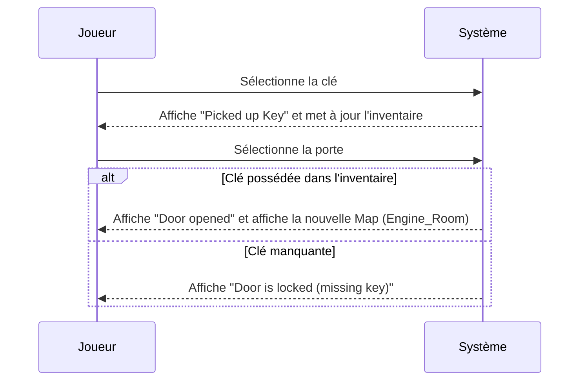
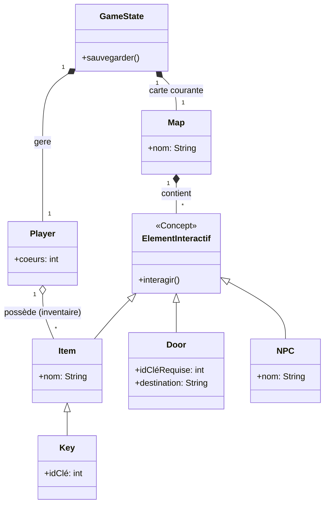
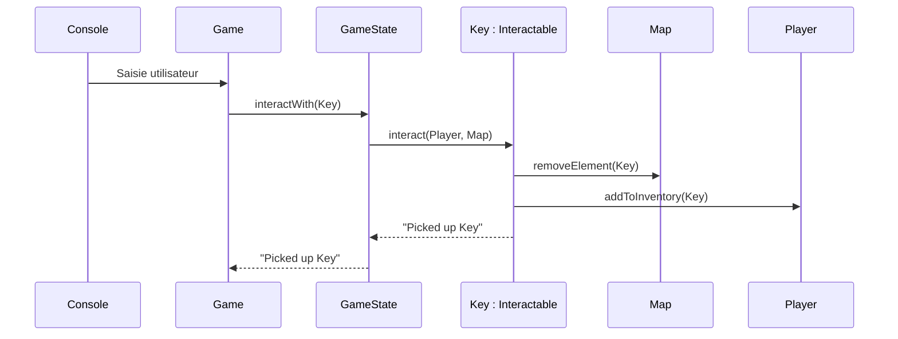
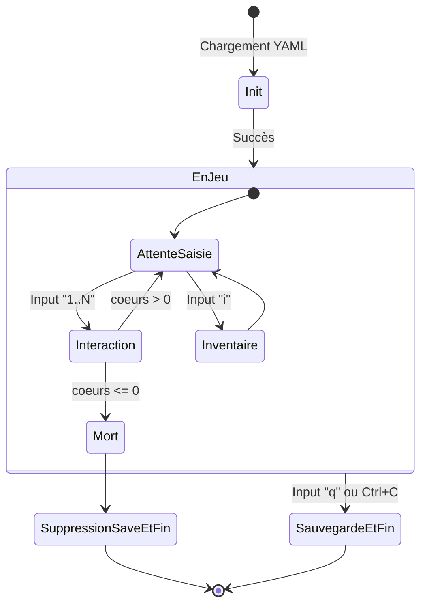

# Rapport de Projet : L'Écho des Ombres (Jeu d'Aventures)

## 1. Cahier des charges

### 1.1. Contexte

Le projet consiste à réaliser un jeu d'aventure en console. Le joueur se déplace dans des maps, interagit avec des
objets et progresse en débloquant des zones.

### 1.2. Objectif du projet

Implémenter un flux jouable minimal correspondant à un premier incrément livrable :

1. Le joueur voit une clé sur la map de départ.
2. Le joueur ramasse la clé.
3. Le joueur ouvre une porte verrouillée avec la clé.
4. Le joueur arrive sur une deuxième map.
5. Le joueur dispose de 3 cœurs de vie.
6. Le Bandit retire un cœur lors d'une interaction.

### 1.3. Exigences fonctionnelles

- Charger l'état du jeu depuis des fichiers YAML (`state.yml` pour la sauvegarde, `maps/*.yml` pour les niveaux).
- Afficher les éléments de map (porte, clé, PNJ).
- Permettre une interaction simple avec les éléments listés via une interface textuelle.
- Ajouter la clé à l'inventaire lors du ramassage.
- Refuser l'ouverture d'une porte sans la clé correspondante.
- Changer de map lors de l'ouverture réussie d'une porte.
- Sauvegarder l'état du joueur en sortie de jeu.
- Afficher les cœurs de vie du joueur dans l'interface.
- Arrêter la partie à 0 cœur et supprimer la sauvegarde (`state.yml`).

### 1.4. Exigences non fonctionnelles & Contraintes

- Le code doit être simple, lisible et préparé pour une évolution future (ex: ajout d'une interface graphique).
- Utilisation de la librairie SnakeYAML pour la persistance.
- Exécution locale possible sur les postes de l'école.

---

## 2. Document d'analyse

### 2.1. Acteurs

- **Joueur** : contrôle le personnage et choisit les interactions.
- **Système de jeu** : charge les données, applique les règles métier et affiche le rendu.

### 2.2. Cas d'utilisation

- **UC1** : Lancer une partie.
- **UC2** : Interagir avec une clé (ramassage).
- **UC3** : Interagir avec une porte (vérification de clé et franchissement).
- **UC4** : Changer de map après ouverture.
- **UC5** : Sauvegarder à la sortie.
- **UC6** : Perdre des cœurs en interagissant avec un PNJ hostile (Bandit).
- **UC7** : Gérer la fin de partie à 0 cœur (suppression de la sauvegarde).

### 2.3. Séquence système (Cas UC2, UC3 et UC4)

Ce diagramme illustre les interactions de type "boîte noire" entre le joueur et le système lors de la résolution d'une
énigme simple (trouver la clé et ouvrir la porte).



### 2.4. Modèle du domaine (Diagramme de classes d'analyse)

Le diagramme suivant met en évidence les concepts significatifs du système, sans entrer dans les détails techniques
d'implémentation.



### 2.5. Règles métier

- Une porte identifiée par un ID `n` s'ouvre seulement si l'inventaire du joueur contient une clé possédant le même ID
  `n`.
- Une clé ramassée disparaît de la carte physique et est ajoutée à l'inventaire logique du joueur.
- Une porte ouverte transfère le joueur vers de nouvelles coordonnées (`destinationMap`, `destinationX`,
  `destinationY`).
- Le joueur commence avec 3 cœurs. Une interaction avec le PNJ `Bandit` retire 1 cœur.
- À 0 cœur, la partie s'arrête définitivement.

---

## 3. Document de conception

### 3.1. Architecture logique

L'architecture logicielle repose sur une séparation en couches légères, préparant le terrain pour un futur modèle MVC
complet :

- **Présentation (Vue/Contrôleur)** : Gérée par `TerminalDisplay` et la boucle d'entrées/sorties de la classe `Game`.
- **Domaine (Modèle)** : Contient la logique métier (`GameState`, `Player`, `Map`, `Door`, `Item`, `Key`, `NPC`,
  `Interactable`).
- **Infrastructure (Persistance)** : Assurée par `Serialization` via la librairie SnakeYAML pour la lecture/écriture des
  ressources.

### 3.2. Diagramme de classes de conception

Le cœur du projet s'appuie sur le polymorphisme et la ségrégation des interfaces (`Displayable` pour l'affichage,
`Interactable` pour les actions métier).

> Note: il est nécessaire d'avoir la version originale (numérique) de ce document pour zoomer sur le diagramme
> ci-dessous.

 ```mermaid
classDiagram
    direction BT
    class Dimensions {
        - int width
        - int height
        + getWidth() int
        + getHeight() int
        + setWidth(int) void
        + setHeight(int) void
    }
    class Displayable {
        <<Interface>>
        + display(TerminalDisplay, int, int) void
    }
    class Door {
        - int destinationX
        - int destinationY
        - String icon
        - int id
        - int y
        - String destinationMap
        - String ANSI_CYAN
        - int x
        + getIcon() String
        + getId() int
        + getX() int
        + getY() int
        + getDestinationMap() String
        + getDestinationX() int
        + setDestinationX(int) void
        + setDestinationY(int) void
        + setDestinationMap(String) void
        + getDestinationY() int
        + setX(int) void
        + setId(int) void
        + setY(int) void
        + setIcon(String) void
        + display(TerminalDisplay, int, int) void
        + interact(Player, Map) String
        + getColor() String
        + getTeleportLabel() String
    }
    class Game {
        - TerminalDisplay display
        - GameState gameState
        - String SAVE_FILE
        - renderDialogOverlay(String, String) void
        - handleTeleportInput(String, List~Interactable~, boolean[]) String?
        - deleteSaveFile() void
        - renderInventoryOverlay(Player) void
        - buildTeleportTargets() List~Interactable~
        + run() void
        - buildTeleportPrompt(List~Interactable~) String
    }
    class GameState {
        - Player player
        + getPlayer() Player
        + setPlayer(Player) void
        + load() GameState
        + load(String) GameState
        + interactWith(Interactable) String
        + save() void
        + getCurrentMap() Map
        + save(String) void
        + display(TerminalDisplay, int, int) void
    }
    class Interactable {
        <<Interface>>
        + String ANSI_RESET
        + getX() int
        + getTeleportLabel() String
        + interact(Player, Map) String
        + getColor() String
        + colorize(String) String
        + getY() int
    }
    class Inventory {
        - ArrayList~Item~ items
        - int maxItemNameLength
        + display(TerminalDisplay, int, int) void
        + getSize() int
        + removeItem(Item) void
        + addItem(Item) void
    }
    class Item {
        - String ANSI_YELLOW
        - int y
        - String name
        - String icon
        - int x
        + getName() String
        + getIcon() String
        + getX() int
        + getY() int
        + setName(String) void
        + setIcon(String) void
        + setX(int) void
        + setY(int) void
        + getTeleportLabel() String
        + getColor() String
        + display(TerminalDisplay, int, int) void
        + interact(Player, Map) String
    }
    class Key {
        - int id
        + getId() int
        + setId(int) void
        + display(TerminalDisplay, int, int) void
    }
    class Main {
        + main(String[]) void
    }
    class Map {
        - Dimensions dimensions
        - String name
        - String background
        - ArrayList~Displayable~ elements
        + display(TerminalDisplay, int, int) void
        + getName() String
        + getBackground() String
        + getDimensions() Dimensions
        + setName(String) void
        + setBackground(String) void
        + setDimensions(Dimensions) void
        + load(String) Map
        + getElements() List~Displayable~
        + setElements(List~Displayable~) void
        + size() int
        + getY() int
        - mapElementTags() Map~Class~?~, String~
        + addElement(Displayable) void
        + getX() int
        + removeElement(Displayable) void
    }
    class NPC {
        - String name
        - int x
        - int y
        - String ANSI_MAGENTA
        - String icon
        + getName() String
        + getIcon() String
        + getX() int
        + getY() int
        + setName(String) void
        + setIcon(String) void
        + setX(int) void
        + setY(int) void
        + getTeleportLabel() String
        + getColor() String
        + display(TerminalDisplay, int, int) void
        + interact(Player, Map) String
    }
    class Player {
        - int maxHearts
        - String name
        - Position position
        - String ANSI_RESET
        - String ANSI_RED
        - String ANSI_GREEN
        - ArrayList~Item~ inventory
        - int hearts
        - String icon
        - String color
        + getName() String
        + getIcon() String
        + getPosition() Position
        + getInventory() ArrayList~Item~
        + getColor() String
        + setColor(String) void
        + setHearts(int) void
        + getMaxHearts() int
        + getHearts() int
        + setName(String) void
        + setInventory(ArrayList~Item~) void
        + setIcon(String) void
        + setPosition(Position) void
        + setMaxHearts(int) void
        + moveLeftOf(int, int) void
        + teleportTo(String, int, int) void
        + getHeartsHud() String
        + addToInventory(Item) void
        + hasKey(int) boolean
        + moveTo(int, int) void
        + display(TerminalDisplay, int, int) void
        + isDead() boolean
        + loseHeart() int
    }
    class Position {
        - int x
        - Map loadedMap
        - int y
        - String map
        + getMap() String
        + getX() int
        + getY() int
        + setX(int) void
        + setY(int) void
        + addX(int) void
        + setMap(String) void
        + addY(int) void
        + getLoadedMap() Map
    }
    class Serialization {
        + load(String, Class~T~, boolean, Map~String, Class~ ?~~, Map~Class~?~, String~) T
        + load(String, Class~T~, boolean, TypeDescription[]) T
        - readSaveFile(String) InputStream
        - normalizeYamlPath(String) String
        + save(String, Object, Map~Class~?~, String~) void
        - readRessource(String) InputStream
    }
    class TerminalDisplay {
        - String[][] buffer
        - String ANSI_RESET
        - findAnsiEnd(String, int) int
        - applyStyle(String, String) String
        + draw_rectangle_centered(int, int, boolean) void
        + getStringWidth(String) int
        + render() void
        + write(char, int, int) void
        + clean() void
        + main(String[]) void
        + draw_rectangle(int, int, int, int, boolean) void
        + write(String, int, int) void
    }
    class Weapon {
        - int hitPoint
        + getHitPoint() int
        + setHitPoint(int) void
        + display(TerminalDisplay, int, int) void
    }

    Map --> Dimensions
    Displayable ..> TerminalDisplay
    Door ..> Displayable
    Door ..> Door
    Door ..> Interactable
    Door ..> Map
    Door ..> Player
    Door ..> TerminalDisplay
    Game ..> Displayable
    Game ..> Game
    Game "1" *--> "gameState 1" GameState
    Game ..> Interactable
    Game ..> Item
    Game ..> Map
    Game ..> Player
    Game "1" *--> "display 1" TerminalDisplay
    GameState ..> Dimensions
    GameState ..> Displayable
    GameState ..> GameState
    GameState ..> Interactable
    GameState ..> Item
    GameState ..> Key
    GameState ..> Map
    GameState ..> Player: «create»
    GameState "1" *--> "player 1" Player
    GameState ..> Position
    GameState ..> Serialization
    GameState ..> TerminalDisplay
    GameState ..> Weapon
    Interactable ..> Interactable
    Interactable ..> Map
    Interactable ..> Player
    Inventory ..> Displayable
    Inventory "1" *--> "items *" Item
    Inventory ..> TerminalDisplay
    Item ..> Displayable
    Item ..> Interactable
    Item ..> Item
    Item ..> Map
    Item ..> Player
    Item ..> TerminalDisplay
    Key ..> Interactable
    Key --> Item
    Key ..> Key
    Key ..> TerminalDisplay
    Main ..> Game: «create»
    Main ..> TerminalDisplay: «create»
    Map "1" *--> "dimensions 1" Dimensions
    Map ..> Dimensions: «create»
    Map ..> Displayable
    Map "1" *--> "elements *" Displayable
    Map ..> Door
    Map ..> Key
    Map ..> Map
    Map ..> NPC
    Map ..> Serialization
    Map ..> TerminalDisplay
    Map ..> Weapon
    NPC ..> Displayable
    NPC ..> Interactable
    NPC ..> Map
    NPC ..> NPC
    NPC ..> Player
    NPC ..> TerminalDisplay
    Player ..> Displayable
    Player "1" *--> "inventory *" Item
    Player ..> Key
    Player ..> Player
    Player "1" *--> "position 1" Position
    Player ..> Position: «create»
    Player ..> TerminalDisplay
    Position "1" *--> "loadedMap 1" Map
    Serialization ..> Serialization
    TerminalDisplay ..> TerminalDisplay: «create»
    Weapon ..> Interactable
    Weapon --> Item
    Weapon ..> TerminalDisplay
```

### 3.3. Fonctionnement métier et Flux d'architecture

La mécanique centrale du jeu est polymorphe. La méthode `GameState.interactWith(Interactable)` délègue l'action vers
`target.interact(player, map)`. Ainsi, chaque entité est responsable de ses propres règles de gestion : `Item` gère son
ramassage, `Door` gère son ouverture, et `NPC` gère la perte de cœurs.

Le diagramme de séquence ci-dessous montre le parcours d'un message métier au travers des différentes couches de l'
architecture lors du ramassage d'un objet :



### 3.4. Cycle de vie et États-Transitions

Le diagramme suivant modélise le cycle de vie général du jeu et de la boucle principale d'interaction.



### 3.5. Choix techniques

- **YAML Polymorphe** : Utilisation de SnakeYAML (JavaBean + tags spécifiques comme `!key`, `!door`, `!npc`) pour
  charger dynamiquement des listes d'objets hétérogènes.
- **Data-Driven Design** : La classe `Door` contient directement les métadonnées de transition (`destinationMap`), ce
  qui évite de coder le graphe des niveaux en dur dans le code Java.
- **Cohésion et Responsabilité** : `Position` est l'unique source de vérité pour les coordonnées du joueur. La vie est
  encapsulée dans `Player` (`hearts`, `loseHeart()`), respectant le principe d'encapsulation.

---

## 4. Manuel utilisateur

### 4.1. Prérequis

- Java installé sur le poste.
- Projet cloné localement.

### 4.2. Lancement du jeu

Vous pouvez lancer directement le .jar fourni:

```sh
java -jar tp-acol-1.0-SNAPSHOT-all.jar
```

ou le compiler et le lancer depuis la source :

```sh
./gradlew shadowJar
java -jar build/libs/tp-acol-1.0-SNAPSHOT-all.jar
```

### 4.3. Commandes en jeu

L'interface textuelle vous proposera des choix numérotés à chaque tour.

- `1`, `2`, `3`... : Interagir avec l'élément correspondant au numéro affiché dans le prompt.
- `i` : Afficher ou masquer l'inventaire du joueur.
- `q` : Quitter la partie (déclenche une sauvegarde immédiate).

### 4.4. Scénario de Démonstration

Pour tester le flux complet développé dans cet incrément :

1. Lancez le jeu (le joueur apparaît dans la `Cargo_Bay`).
2. Choisissez le numéro correspondant à la clé (Key) pour la ramasser.
3. Choisissez ensuite le numéro de la porte (Door).
4. La clé étant dans votre inventaire, la porte s'ouvre et vous téléporte dans la `Engine_Room`.
5. Si vous interagissez avec le `Bandit`, vous perdrez 1 cœur de vie. À 0 cœur, la partie est perdue et la sauvegarde
   est effacée.

*(Note : Le fichier de sauvegarde `state.yml` est généré à la racine du projet).*

---

## 5. Bilan sur les outils

### 5.1. Outils utilisés

- **IDE** : IntelliJ IDEA (développement, refactoring et génération des diagrammes UML de conception).
- **Build & Tests** : Gradle.
- **Persistance** : Librairie SnakeYAML.
- **Modélisation additionnelle** : Mermaid (pour les diagrammes de séquence et d'états-transitions intégrés au rapport
  Markdown).

### 5.2. Problèmes rencontrés

Lors du développement, nous avons été confrontés à plusieurs défis :

- **Sérialisation YAML hétérogène** : Difficulté à mapper une liste d'éléments contenant des types d'objets différents (
  `Key`, `Door`, `NPC`) au sein d'une même carte.
- **Génération Lombok et Sérialisation** : La présence de champs *transients* et le code généré par Lombok entraient
  parfois en conflit avec les instanciations automatiques de SnakeYAML.
- **Couplage de la logique métier** : Un risque initial de voir toute la logique du jeu (gestion de la vie, ouvertures
  des portes) centralisée dans une boucle `Game` monolithique.

### 5.3. Solutions appliquées

- **Tags YAML** : Utilisation de tags explicites pour forcer le typage lors de la désérialisation polymorphe par
  SnakeYAML.
- **Design Pattern & OOP** : Création de l'interface `Interactable`. Chaque classe du domaine (`Item`, `Door`, `NPC`)
  porte désormais sa propre logique d'interaction, déléguant ainsi les responsabilités et évitant un `GameState` trop
  couplé. L'architecture est ainsi prête à évoluer vers un MVC complet.
