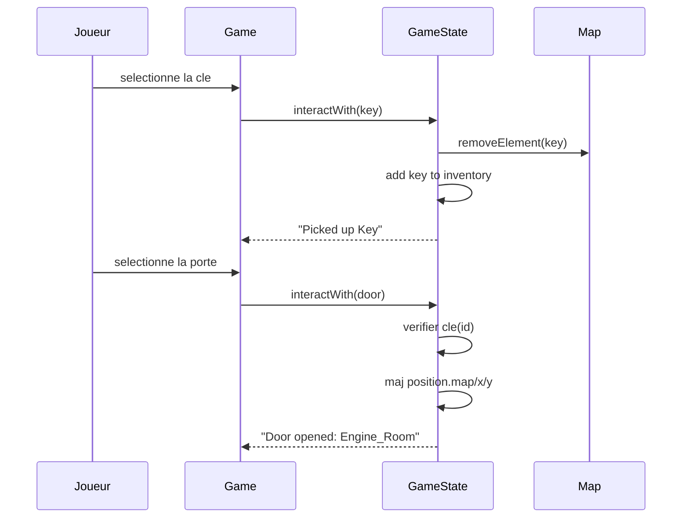

# Analyse

## 1. Acteurs

- Joueur: controle le personnage et choisit les interactions.
- Systeme de jeu: charge les donnees, applique les regles et affiche.

## 2. Cas d'utilisation (increment)

- UC1: Lancer une partie.
- UC2: Interagir avec une cle (ramassage).
- UC3: Interagir avec une porte (verification de cle).
- UC4: Changer de map apres ouverture.
- UC5: Sauvegarder a la sortie.

## 3. Sequence systeme (UC2+UC3+UC4)

## 4. Concepts d'analyse

- `GameState`: etat applicatif principal (joueur + map courante).
- `Player`: position + inventaire.
- `Map`: decor + liste d'elements affichables.
- `Item`/`Key`: objets ramassables.
- `Door`: element interactif avec destination.

## 5. Regles metier

- Une porte d'id `n` s'ouvre seulement si l'inventaire contient une cle d'id `n`.
- Une cle ramassee disparait de la map et est ajoutee a l'inventaire.
- Une porte ouverte peut transferer vers `destinationMap`, `destinationX`, `destinationY`.

