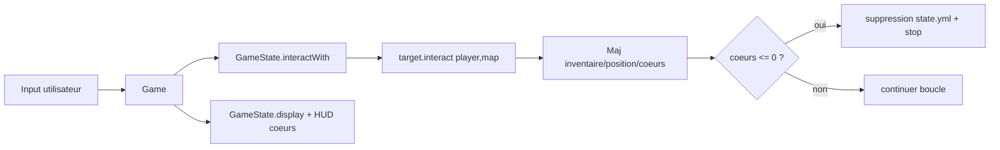

# Conception

## 1. Architecture logique

Architecture en couches legeres:

- Presentation: `TerminalDisplay`, boucle `Game`.
- Domaine: `GameState`, `Player`, `Map`, `Door`, `Item`, `Key`.
- Domaine: `GameState`, `Player`, `Map`, `Door`, `Item`, `Key`, `NPC`, `Interactable`.
- Persistance fichier: `Serialization` (SnakeYAML), ressources `state.yml` et `maps/*.yml`.

## 2. Fonctionnement metier

Le coeur du projet est polymorphe:

- `GameState.interactWith(Interactable)` delegue vers `target.interact(player, map)`.
- `Item` gere son ramassage.
- `Door` gere son ouverture et sa transition de map.
- `NPC` (Bandit) gere la perte de coeurs.
- `Player` encapsule les operations de vie/deplacement (`loseHeart`, `isDead`, etc.).

La boucle `Game` reste simple:

- construit les cibles interactives depuis la map courante,
- laisse les objets de domaine appliquer leurs regles OOP,
- re-affiche l'etat.

## 3. Choix de conception

- SnakeYAML JavaBean + tags (`!key`, `!door`, `!npc`, `!weapon`).
- `Door` contient les metadonnees de transition pour eviter le hardcode.
- `Position` reste source de verite pour map/x/y du joueur.
- Les interactions sont portees par `Interactable` pour limiter le couplage dans `GameState`.
- Les coeurs sont stockes dans `Player` et affiches par le HUD de `GameState`.

## 4. Flux technique

## 5. Evolutions prevues

- Mouvement case par case (ZQSD/fleches) avec collision map.
- Etats de portes (ouverte/fermee).
- Decoupage des commandes (controleur dedie).

