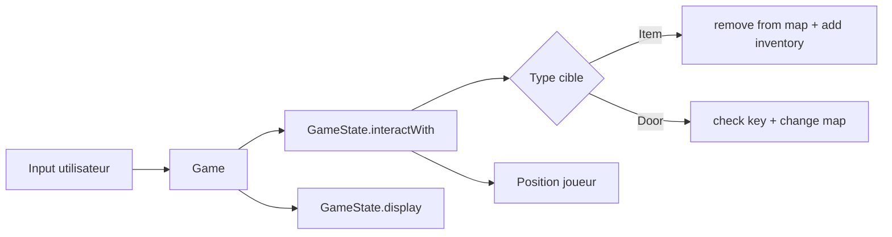

# Conception

## 1. Architecture logique

Architecture en couches legeres:

- Presentation: `TerminalDisplay`, boucle `Game`.
- Domaine: `GameState`, `Player`, `Map`, `Door`, `Item`, `Key`.
- Persistance fichier: `Serialization` (SnakeYAML), ressources `state.yml` et `maps/*.yml`.

## 2. Increment implemente

Le coeur de l'increment est dans `GameState`:

- `interactWith(Teleportable)`
- `pickUpItem(Item)`
- `openDoor(Door)`

La boucle `Game` reste simple:

- construit les cibles interactives depuis la map courante,
- laisse `GameState` appliquer les regles,
- re-affiche l'etat.

## 3. Choix de conception

- SnakeYAML JavaBean + tags (`!key`, `!door`, `!npc`, `!weapon`).
- `Door` contient les metadonnees de transition pour eviter le hardcode.
- `Position` reste source de verite pour map/x/y du joueur.

## 4. Flux technique

## 5. Evolutions prevues

- Mouvement case par case (ZQSD/fleches) avec collision map.
- Etats de portes (ouverte/fermee).
- Decoupage des commandes (controleur dedie).

